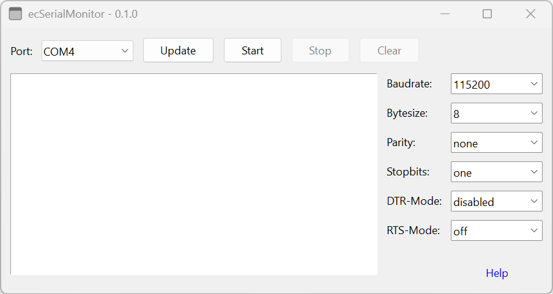

# ecSerialMonitor

This application serves as a user interface for managing serial port communication. It allows users to select various parameters such as baud rate, byte size, DTR mode, parity, RTS mode, and stop bits, facilitating the configuration and monitoring of serial connections. The application is designed to provide a seamless experience for users interacting with serial devices, ensuring efficient data transmission and error handling.

> [!CAUTION]
> This application is still in the development.

> [!NOTE]
It was developed in [Lua](https://www.lua.org/) with the help of the windows programming framework [LuaRT](https://www.luart.org/).
